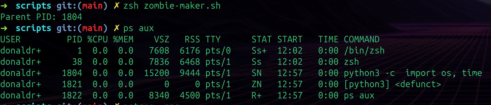
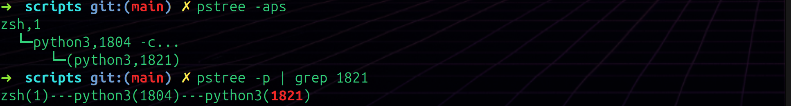
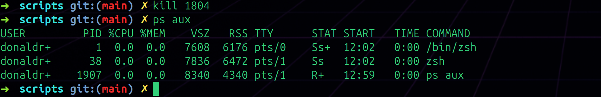

# Day 001 Debug Notes - Zombie Process

---

## The Challenge
Run `zombie-maker.sh`, find the zombie process, figure out what it is, identify its parent, and clean it up using `ps`, `pstree`, and `kill`.

---

## Step 1 - Run the Script and Find the Zombie

### Commands
```bash
zsh zombie-maker.sh
ps aux
```

### Observations



Output:

```
USER       PID  %CPU %MEM   VSZ   RSS TTY   STAT START  TIME COMMAND
donaldr+     1   0.0  0.0  7608  6176 pts/0  Ss+  12:02  0:00 /bin/zsh
donaldr+    38   0.0  0.0  7836  6468 pts/1  Ss   12:02  0:00 zsh
donaldr+  1804   0.0  0.0 15200  9444 pts/1  SN   12:57  0:00 python3 -c import os, time
donaldr+  1821   0.0  0.0     0     0 pts/1  ZN   12:57  0:00 [python3] <defunct>
donaldr+  1822   0.0  0.0  8340  4500 pts/1  R+   12:57  0:00 ps aux
```

What I noticed:
- Script printed **Parent PID: 1804** right away
- In `ps aux` I can see PID **1821** with state `ZN` and the name `[python3] <defunct>` - that's the zombie
- `<defunct>` literally means dead/gone - it's not running, just stuck in the process table
- `ZN` - `Z` is zombie state, `N` is low priority (from the nice value in the script)
- The zombie has **VSZ: 0 and RSS: 0** - no memory, no virtual memory. Confirmed it's using nothing, just occupying a slot
- PID **1804** is the sleeping parent - state `SN`, still alive

---

## Step 2 - Confirm the Parent-Child Relationship

### Commands
```bash
pstree -aps
pstree -p | grep 1821
```

### Observations



Output:

```
# pstree -aps
zsh,1
 └─python3,1804 -c...
      └─(python3,1821)

# pstree -p | grep 1821
zsh(1)---python3(1804)---python3(1821)
```

What I noticed:
- `pstree -aps` shows the full tree nicely - zsh spawned python3(1804), which spawned python3(1821)
- The zombie `1821` is in parentheses in pstree - I think that's how pstree shows a defunct process
- `pstree -p | grep 1821` was useful to quickly find just that branch with PIDs
- Confirmed: **1804 is the parent**, **1821 is the zombie child**
- The zombie can't clean itself up - only the parent can, or the parent has to die first

---

## Step 3 - Kill the Parent to Clean Up the Zombie

### Command
```bash
kill 1804
ps aux
```

### Observations



Output after killing 1804:

```
USER       PID  %CPU %MEM   VSZ   RSS TTY   STAT START  TIME COMMAND
donaldr+     1   0.0  0.0  7608  6176 pts/0  Ss+  12:02  0:00 /bin/zsh
donaldr+    38   0.0  0.0  7836  6472 pts/1  Ss   12:02  0:00 zsh
donaldr+  1907   0.0  0.0  8340  4340 pts/1  R+   12:59  0:00 ps aux
```

What I noticed:
- Both **1804 and 1821 are completely gone** from the process table
- `kill 1804` sent SIGTERM to the parent - once the parent died, the zombie had nobody left
- The zombie got re-parented to PID 1 (init/systemd) which immediately reaped it
- Back to just zsh and the `ps aux` command itself - clean
- You can't `kill` a zombie directly because it's already dead. You have to go after the parent

---

## What I Learned

- A zombie is a process that's finished but hasn't been cleaned up because the parent never acknowledged it
- It shows up as `Z` in STAT and `<defunct>` in the command column
- Zombies use zero CPU and zero memory - they're just a slot in the process table
- The fix is killing the parent, which causes init (PID 1) to adopt and immediately reap the zombie
- First time the zombie disappeared on its own because the 300 second sleep ran out before I could kill the parent — turns out that's the same thing, parent died naturally and init cleaned it up
- `pstree -aps` is really useful for seeing the full parent-child relationship visually

