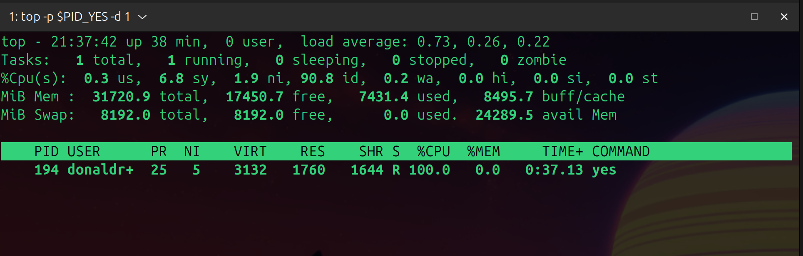
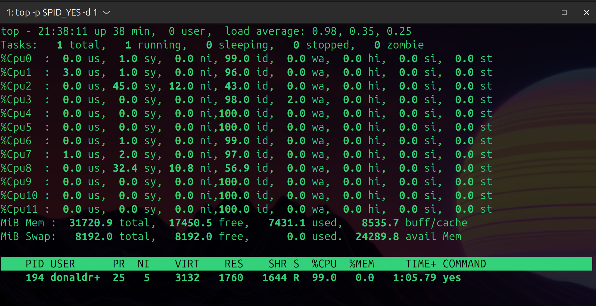
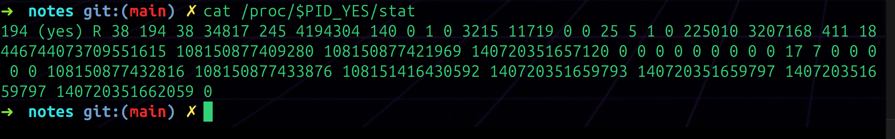
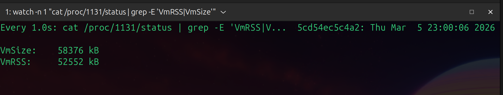

# Day 001 Lab Notes — Process Observation

---

## 1. Create a CPU-Hungry Process — `yes > /dev/null &`

### Command
```bash
yes > /dev/null &
PID_YES=$!
```

### What It Shows
`yes` is a program that just prints "y" forever in a loop — nothing fancy. Redirecting it to `/dev/null` means the output goes nowhere so it doesn't flood the terminal. The `&` runs it in the background so I can keep using my shell. `$!` saves the PID into a variable so I don't have to remember the number.

### Observations
- Process started fine, got PID **194**
- Couldn't really "see" it doing anything from the terminal since output was going to `/dev/null`
- But I knew something was happening because the shell came back immediately (background job)
- Interesting that something so simple — just printing "y" forever — can max out a CPU core

---

## 2. Watch It in Real Time — `top -p $PID_YES -d 1`

### Command
```bash
top -p $PID_YES -d 1
# Press '1' to see per-CPU breakdown
```

### What It Shows
Opens `top` but only showing the one process I care about, refreshing every second. Pressing `1` splits the CPU view so you can see each core individually instead of one combined number.

### Observations





Output I saw:

```
PID   USER     PR  NI  VIRT   RES   SHR S  %CPU  %MEM  TIME+    COMMAND
194   donaldr+ 25   5  3132  1760  1644 R 100.0   0.0  0:37.13  yes
```

What I noticed:
- `%CPU` was sitting at **100%** the whole time — one entire core completely taken over by `yes`
- `%MEM` was basically **0.0** — it's using almost no memory at all, just CPU
- `PR: 25` and `NI: 5` — I think the nice value means it's running at slightly lower priority than normal? So other processes would get CPU first if they needed it
- `TIME+` kept growing — that's the total CPU time it's burned through
- After pressing `1` I could actually see which specific core was getting hammered — the rest were mostly idle
- `S: R` means it's in a Running state, actively on a CPU — makes sense

---

## 3. Check Process Details — `cat /proc/$PID_YES/status`

### Command
```bash
cat /proc/$PID_YES/status
```

### What It Shows
`/proc` is a virtual folder the kernel creates to expose info about running processes. Each process gets its own folder by PID. The `status` file inside is a human-readable dump of everything the kernel knows about that process.

### Observations
Full output:

```
Name:    yes
State:   R (running)
Pid:     194
PPid:    38
Threads: 1
VmPeak:  3132 kB
VmSize:  3132 kB
VmRSS:   1760 kB
VmData:  224 kB
VmStk:   132 kB
VmExe:   16 kB
VmLib:   1748 kB
Cpus_allowed_list: 0-11
nonvoluntary_ctxt_switches: 4188
voluntary_ctxt_switches:    2
```

What I noticed:
- **State: R** — actively running, not sleeping or waiting on anything
- **VmRSS: 1760 kB** — that's like 1.7MB of actual RAM. Tiny. `yes` barely uses any memory at all
- **VmExe: 16 kB** — the actual program binary is only 16KB. Makes sense, it literally just prints "y"
- **VmLib: 1748 kB** — the linked libraries take up way more space than the program itself, which I thought was interesting
- **nonvoluntary_ctxt_switches: 4188** — the kernel had to kick it off the CPU 4188 times because it never willingly gives up the CPU. Makes sense for an infinite loop
- **voluntary_ctxt_switches: 2** — it only yielded on its own twice, basically never
- **Cpus_allowed_list: 0-11** — it's allowed to run on any of the 12 cores, the scheduler picks where

---

## 4. Raw Kernel Stats — `cat /proc/$PID_YES/stat`

### Command
```bash
cat /proc/$PID_YES/stat
```

### What It Shows
This is the machine-readable version of the same process info — one long line of numbers. Apparently this is what tools like `top` and `ps` actually read under the hood. Harder to read but good to know it exists.

### Observations



Output (it's all on one line, truncated here):

```
194 (yes) R 38 194 38 34817 245 4194304 140 0 1 0 3215 11719 0 0 25 5 1 0 ...
```

What I noticed:
- Position 3 is `R` — running state again, consistent with `/status`
- Position 4 is `38` — that's the parent PID (my shell)
- There are numbers for user CPU time and kernel CPU time separately — `3215` and `11719`. The kernel time is actually higher which I didn't expect, not totally sure why yet
- It's a lot of numbers and hard to read raw but at least I can see where tools like `top` are pulling their data from

---

## 5. Check Open Files — `ls -la /proc/$PID_YES/fd/`

### Command
```bash
ls -la /proc/$PID_YES/fd/
```

### What It Shows
`fd` stands for file descriptor. In Linux everything is a file — terminals, pipes, actual files. This shows every "file" the process currently has open as a list of symlinks.

### Observations


Output:

```
lrwx------ 1 donaldraph donaldraph 64 Mar 5 21:40  0 -> /dev/pts/1
l-wx------ 1 donaldraph donaldraph 64 Mar 5 21:40  1 -> /dev/null
lrwx------ 1 donaldraph donaldraph 64 Mar 5 21:40  2 -> /dev/pts/1
```

What I noticed:
- Only **3 file descriptors** — stdin, stdout, stderr. That's the bare minimum
- **fd 1 (stdout) → /dev/null** — this is from the `> /dev/null` redirect I used. Output going nowhere
- **fd 0 and fd 2 → /dev/pts/1** — both stdin and stderr still point back to my terminal
- Somehow reassuring that `yes` isn't doing anything weird — no open network connections, no files, nothing extra

---

## 6. Kill It — `kill $PID_YES`

### Command
```bash
kill $PID_YES
```

### What It Shows
Sends a signal telling the process to stop. Default signal is SIGTERM — it's not a hard force-kill, more like a request. `yes` doesn't do anything special on receiving it so it just exits.

### Observations


Output:

```
[1]  + 194 terminated  yes > /dev/null
```

What I noticed:
- `terminated` — it stopped because of the kill signal, not because it finished on its own
- The shell reports this when you next hit enter, not immediately — because it was a background job
- CPU usage on that core dropped back to basically nothing right after. Went from 100% to idle instantly

---

## 7. Create a Memory-Hungry Process — `python3`

### Command
```bash
python3 -c "
import time
data = []
for i in range(50):
    data.append('X' * 1024 * 1024)  # 1MB per iteration
    print(f'Allocated {i+1} MB')
    time.sleep(0.5)
time.sleep(30)
" &
PID_MEM=$!
```

### What It Shows
Runs a Python script in the background that allocates memory 1MB at a time, pausing half a second between each chunk, up to 50MB total. Then holds onto all of it for 30 seconds before exiting naturally. Opposite of `yes` — barely uses CPU, just steadily eats RAM.

### Observations
Got PID **1131**.

- Could see "Allocated X MB" printing before it went to background
- No noticeable CPU spike — totally different feel from the `yes` process
- Just quietly sitting there holding memory, which is kind of what a memory leak looks like I guess

---

## 8. Watch Memory Grow — `watch -n 1`

### Command
```bash
watch -n 1 "cat /proc/$PID_MEM/status | grep -E 'VmRSS|VmSize'"
```

### What It Shows
`watch` reruns a command on a timer and refreshes the output — every 1 second here. The inner command pulls just the two memory fields from the process status file so I can watch them climb in real time.

### Observations



What I saw mid-allocation:

```
Every 1.0s: cat /proc/1131/status | grep -E 'VmRSS|VmSize'    Thu Mar 5 23:00:06 2026

VmSize:    58376 kB
VmRSS:     52552 kB
```

What I noticed:
- **VmRSS: 52552 kB** (~51 MB) — this is the actual physical RAM being used. Was watching it tick up every second
- **VmSize: 58376 kB** (~57 MB) — a bit higher than VmRSS. Still not totally clear on why — something to do with virtual vs physical memory, will look into it
- Watching the numbers go up live was actually really satisfying — made the concept click more than just reading about it
- The timestamp in the top right updates every second which was a nice touch for knowing when I grabbed the screenshot

---

## 9. Kill It — `kill $PID_MEM`

### Command
```bash
kill $PID_MEM
```

### What It Shows
Same as before — sends SIGTERM to the process. Memory process stops, all the RAM it was holding gets returned to the OS immediately.

### Observations


```
[1]  + 1131 terminated  python3 -c  > /dev/null 2>&1
```

What I noticed:
- `terminated` again — same pattern as killing `yes`
- `2>&1` at the end — I think this means stderr was also redirected to `/dev/null` along with stdout. Will confirm
- The memory just disappeared the moment the process ended — the OS reclaims it instantly
- Kind of obvious but actually seeing it confirmed makes it stick better

---
