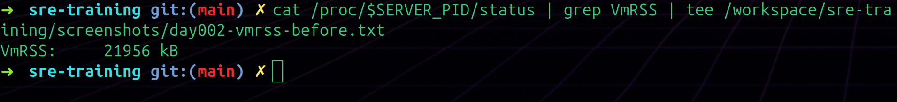
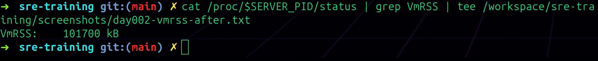
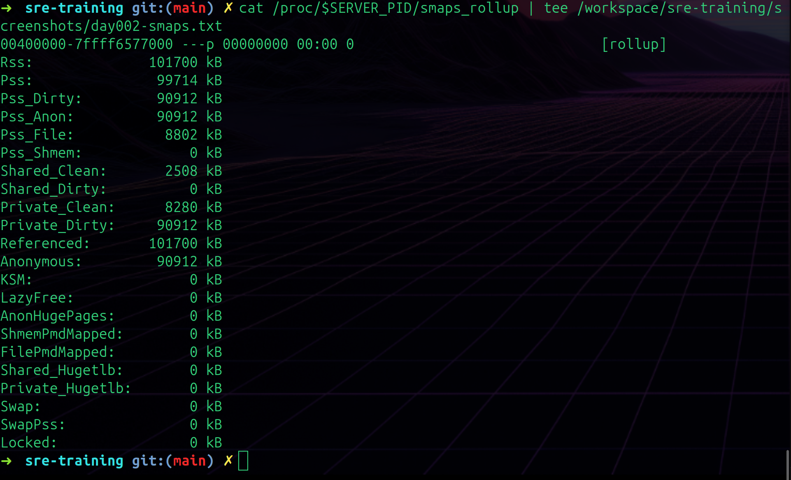
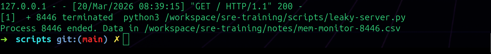
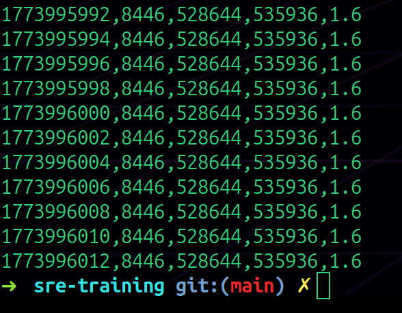
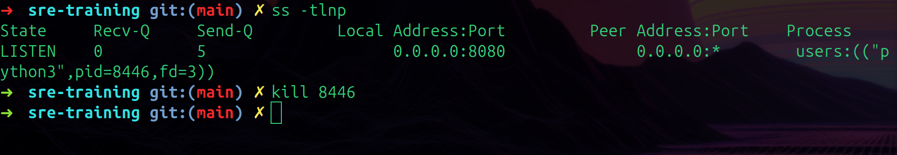

# Day 002 Debug — Leaky Server & Memory Monitor

---

## The Bug

A Python HTTP server where every request adds 10KB of data to a dictionary (`CACHE`) that never gets cleared. The cache grows forever with no expiry, no size limit, no cleanup.

```python
# BUG: keys are never cleaned up
CACHE[f"request_{counter}"] = "X" * 10240  # 10KB per request
```

Every single request writes to this dictionary and nothing ever deletes from it. If it's in a real server that handles thousands of requests, this would eventually eat all available RAM.

---

## Step 1 — Capture VmRSS Before

### Command
```bash
python3 /workspace/sre-training/scripts/leaky-server.py &
SERVER_PID=$!
cat /proc/$SERVER_PID/status | grep VmRSS | tee /workspace/sre-training/screenshots/day002-vmrss-before.txt
```

### Observations



```
VmRSS:    21956 kB
```

Server just started, no requests yet. ~21MB baseline — that's just the Python interpreter and HTTP server overhead before any traffic enters.

---

## Step 2 — Bombard It

### Commands
```bash
# Terminal 1 — start monitor
bash /workspace/sre-training/scripts/memory-monitor.sh $SERVER_PID

# Terminal 2 — send requests
for i in $(seq 1 8000); do curl -s http://localhost:8080 > /dev/null; done
```

500 requests sent from terminal 2 while terminal 1 was recording memory every 2 seconds to a CSV file.

---

## Step 3 — Capture VmRSS After

### Command
```bash
cat /proc/$SERVER_PID/status | grep VmRSS | tee /workspace/sre-training/screenshots/day002-vmrss-after.txt
```

### Observations



```
VmRSS:    101700 kB
```

What I noticed:
- **Before: 21956 kB → After: 101700 kB**
- **Total growth: 79744 kB (~78MB)**
- **Requests sent: 8000**
- **Growth per request: 79744 ÷ 8000 = ~10 kB per request**
- Matches the code exactly — `"X" * 10240` is 10KB per request
- The important thing is the trend — memory goes up with every request and never comes down

Confirmed with a second heavier run (50000 requests):
- **Before: ~21956 kB → After: 528644 kB**
- **Total growth: 506688 kB (~495MB)**
- **Growth per request: 506688 ÷ 50000 = ~10.1 kB per request**
- Both runs land at ~10KB per request — the leak is consistent and predictable. Every single request costs ~10KB that never gets freed

---

## Step 4 — smaps_rollup Breakdown

### Command
```bash
cat /proc/$SERVER_PID/smaps_rollup | tee /workspace/sre-training/screenshots/day002-smaps.txt
```

### Observations



```
Rss:               101700 kB
Pss:                99714 kB
Pss_Dirty:          90912 kB
Private_Dirty:      90912 kB
Anonymous:          90912 kB
Private_Clean:       8280 kB
Shared_Clean:        2508 kB
Swap:                   0 kB
```

What I noticed:
- **Private_Dirty: 90912 kB** — the most important number. "Private" means only this process owns it, "Dirty" means it's been written to and can't be reclaimed without saving. This is basically the leaked CACHE data sitting in RAM
- **Anonymous: 90912 kB** — matches Private_Dirty exactly. Anonymous memory = heap allocations (Python objects, the dictionary contents). Not backed by any file on disk
- **Private_Clean: 8280 kB** — file-backed memory that hasn't been modified. Python bytecode, shared libraries loaded as read-only
- **Swap: 0 kB** — nothing swapped out, all the leaked data is in RAM with nowhere to go
- The ~90MB of Private_Dirty is the CACHE dictionary made visible

---

## Step 5 — memory-monitor.sh Output

### Command
```bash
bash /workspace/sre-training/scripts/memory-monitor.sh $SERVER_PID
```

### Observations



The script printed when the server was killed:
```
Process 8446 ended. Data in /workspace/sre-training/notes/mem-monitor-8446.csv
```

The `while kill -0 "$PID"` loop checks every iteration "is this process still alive?" — the moment the server died, the condition failed and the script exited cleanly on its own. Didn't need to manually stop the monitor.



CSV tail showed RSS at **528644 kB** (~516MB) at **1.6% of total RAM** — this was from a heavier bombardment run. The numbers just kept climbing with no ceiling.

---

## Step 6 — Finding a Running Server with `ss`

When I hit "address already in use" I needed to find what was holding port 8080:

### Command
```bash
ss -tlnp
```

### Observations



```
LISTEN  0  5  0.0.0.0:8080  0.0.0.0:*  users:(("python3",pid=8446,fd=3))
```

The PID is right there in the `users` column. Then just `kill 8446` to free the port.

This is now my go-to when anything says "address already in use."

---

## Evening Build — memory-monitor.sh

### What the Script Does
Monitors a PID's memory every 2 seconds and writes the readings to a CSV file. Stops automatically when the process dies.

### Script
```bash
#!/bin/bash
set -euo pipefail
PID=${1:?"Usage: $0 <PID>"}
OUTPUT="/workspace/sre-training/notes/mem-monitor-${PID}.csv"
echo "timestamp,pid,rss_kb,vsz_kb,pct_mem" > "$OUTPUT"

while kill -0 "$PID" 2>/dev/null; do
    TIMESTAMP=$(date +%s)
    DATA=$(ps -p "$PID" -o rss=,vsz=,%mem= 2>/dev/null || echo "0 0 0")
    RSS=$(echo $DATA | awk '{print $1}')
    VSZ=$(echo $DATA | awk '{print $2}')
    PCT=$(echo $DATA | awk '{print $3}')
    echo "$TIMESTAMP,$PID,$RSS,$VSZ,$PCT" >> "$OUTPUT"
    sleep 2
done
echo "Process $PID ended. Data in $OUTPUT"
```

### Things I learned from writing this:

- **`PID=${1:?"Usage: $0 <PID>"}`** — `$1` is the first argument passed to the script. The `:?` part makes it crash with a helpful message if you forget to pass one. So running `bash memory-monitor.sh` with no argument prints the usage message instead of silently breaking
- **`while kill -0 "$PID"`** — `kill -0` doesn't actually kill anything, it just checks if the process exists. Returns 0 (success) if alive, non-zero if dead. So the loop keeps running as long as the process is alive and stops itself when it dies
- **`2>/dev/null`** — suppresses any errors from `kill -0` or `ps` so the output stays clean
- **`|| echo "0 0 0"`** — if `ps` fails (process already gone), output "0 0 0" instead of crashing the script
- **`date +%s`** — prints the current time as a Unix timestamp (seconds since 1970). Easier to work with than formatted dates when doing maths later
- Had to fix `$HOME` pointing to the wrong directory — changed to hardcoded `/workspace/` path since that's where the actual files live in this container

### Issues hit:
- `$HOME` pointed to `/home/donaldraph/` but files are in `/workspace/` — docker environment mismatch
- Had to open a second terminal with `docker exec -it cloudlab zsh` to bombard the server while the monitor ran in terminal 1

---

## What I Learned Today

- `free -h` is the quick check, `/proc/meminfo` is the full picture
- `MemAvailable` is more useful than `MemFree` — it includes memory the kernel can reclaim from cache
- `vmstat` `si`/`so` both 0 means no swapping — that's important health signal for memory
- `Committed_AS` being larger than physical RAM is okay because of overcommit
- cgroups lab failed in Docker — the filesystem is read-only in unprivileged containers, and the system uses cgroups v2 not v1
- The leaky server grew from 21MB to 100MB+ just from 8000 requests — and the memory never gets freed
- `Private_Dirty` in smaps_rollup is the real indicator of leaked heap memory
- `ss -tlnp` finds what process owns a port — useful every time "address already in use" shows up
- `while kill -0 "$PID"` is a clean pattern for "run until this process dies"
