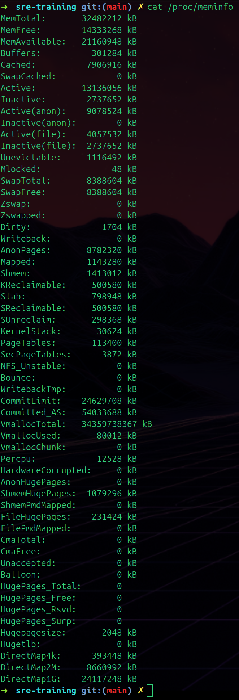
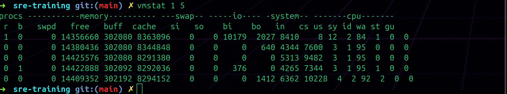
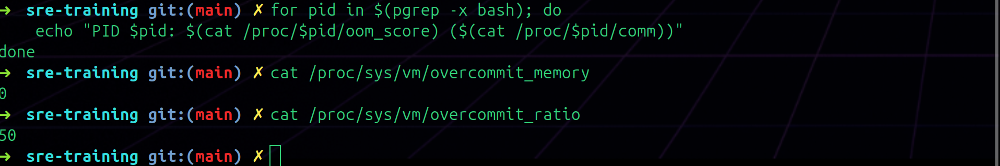
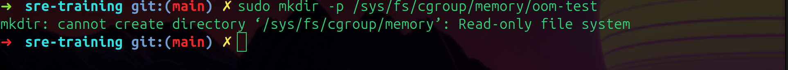

# Day 002 — Memory: Virtual, Physical, and the OOM Killer

---

## 1. System Memory Overview — `free -h`

### Command
```bash
free -h
```

### What It Shows
Quick human-readable summary of total, used, free, shared, buff/cache, and available memory. Also shows swap usage.

### Observations


Output observed:

```
               total        used        free      shared  buff/cache   available
Mem:            30Gi        10Gi        14Gi       1.3Gi       8.1Gi        20Gi
Swap:          8.0Gi          0B       8.0Gi
```

What I noticed:
- 30GB total RAM, 10GB used, 20GB available — enough of headroom
- Swap is empty — `0B` used out of 8GB
- `buff/cache` at 8.1GB — the kernel is using spare RAM to cache disk reads, which is normal and good
- The difference between `free` (14GB) and `available` (20GB) — available is higher because the kernel can reclaim buff/cache if needed. So "available" is the more useful number when checking how much I can actually use

---

## 2. Detailed Memory Fields — `cat /proc/meminfo`

### Command
```bash
cat /proc/meminfo
```

### What It Shows
Every memory metric the kernel tracks internally, exposed as a text file. This is where tools like `free` pull their data from.

### Observations



Key fields I looked at:

```
MemTotal:       32482212 kB
MemFree:        14333268 kB
MemAvailable:   21160948 kB
SwapTotal:       8388604 kB
SwapFree:        8388604 kB
Dirty:              1704 kB
Committed_AS:   54033688 kB
```

What I noticed:
- **SwapFree equals SwapTotal** — nothing has been swapped, system isn't under memory pressure
- **Dirty: 1704 kB** — data written but not yet flushed to disk. Small amount, which is normal
- **Committed_AS: 54033688 kB (~54GB)** — total virtual memory all processes have requested. Way more than the 30GB of physical RAM. This is allowed because of overcommit — the kernel lets processes ask for more than exists, betting they won't all use it at once
- Still not 100% on all the fields — `Unevictable`, `Mlocked`, `KReclaimable` will need more reading

---

## 3. Live System Stats — `vmstat 1 5`

### Command
```bash
vmstat 1 5
```

### What It Shows
Snapshot of system activity every 1 second, 5 times. It covers processes, memory, swap, I/O, system calls, and CPU breakdown.

### Observations



Output observed:

```
procs -----------memory---------- ---swap-- -----io---- -system-- -------cpu-------
 r  b   swpd   free   buff  cache   si   so    bi    bo   in   cs us sy id wa st gu
 1  0      0 14356660 302080 8363096    0    0 10179 2027 8410   8 12  2 84  1  0  0
 0  0      0 14380436 302080 8344848    0    0     0  640 4344 7600  3  1 95  0  0  0
 0  0      0 14425576 302080 8291380    0    0     0    0 5313 9482  3  1 95  0  0  0
 0  1      0 14422888 302092 8292036    0    0   376    0 4265 7344  3  1 95  1  0  0
 0  0      0 14409352 302192 8294152    0    0     0 1412 6362 10228  4  2 92  2  0  0
```

What I noticed:
- **si and so are both 0 across all rows** — no swap activity at all, confirmed
- **id (idle) is 84-95%** — CPU is mostly doing nothing
- **wa (wait) is 0-2%** — CPU barely waiting on I/O
- **First row bi (block in) shows 10179** — disk read spike right when I ran the command, probably the kernel reading something. Dropped to near 0 after
- `swpd` column is 0 throughout — no swap in use at all

---

## 4. OOM Scores and Overcommit Config

### Commands
```bash
for pid in $(pgrep -x bash); do
    echo "PID $pid: $(cat /proc/$pid/oom_score) ($(cat /proc/$pid/comm))"
done

cat /proc/sys/vm/overcommit_memory
cat /proc/sys/vm/overcommit_ratio
```

### What It Shows
`oom_score` is a number the kernel gives every process — higher score means more likely to get killed first if the system runs out of memory. `overcommit_memory` controls how aggressively the kernel allows memory overcommitment.

### Observations



Output observed:

```
# oom_score loop returned nothing

overcommit_memory: 0
overcommit_ratio: 50
```

What I noticed:
- The `pgrep -x bash` loop returned nothing — running zsh not bash, so no matching processes. The loop logic was fine, just no bash processes in this environment
- **overcommit_memory: 0** — kernel uses heuristics to decide whether to allow a memory allocation. Doesn't blindly allow everything but doesn't strictly limit to physical RAM either
- **overcommit_ratio: 50** — system can commit up to 50% of RAM + swap beyond what's physically available. Roughly (30GB + 8GB) * 50% = ~19GB of extra virtual memory allowed on top of physical
- This explains why `Committed_AS` in `/proc/meminfo` can be 54GB on a 30GB machine

---

## 5. OOM Killer Lab — cgroups (Failed)

### What Was Supposed to Happen
Create a memory-limited cgroup, run a process inside it that allocates memory until it hits the 50MB cap, and watch the OOM killer terminate it. Then check `dmesg` for the kernel log entry.

### Commands
```bash
sudo mkdir -p /sys/fs/cgroup/memory/oom-test
echo 50000000 | sudo tee /sys/fs/cgroup/memory/oom-test/memory.limit_in_bytes
```

### What Actually Happened



Output:

```
mkdir: cannot create directory '/sys/fs/cgroup/memory': Read-only file system
```

Ran the mkdir and got that error immediately. Wasn't expecting it — sudo usually gets around permission issues so "Read-only file system" felt different. Everything else cascaded from there — `cgroup.procs` didn't exist, `dmesg` returned permission denied, `memory.failcnt` didn't exist.

Went digging to figure out why. Turns out I'm inside a Docker container and the cgroup filesystem gets mounted read-only by default — containers aren't supposed to be able to create or modify cgroups because that could let them escape their own resource limits or mess with the host.

Also noticed the lab uses `/sys/fs/cgroup/memory/` which is a cgroups v1 path. Checked my system and it's running cgroups v2 which has a completely different structure — there's no `memory/` subfolder at all. So even if the container had write access, the path wouldn't exist. Would have needed to rewrite the commands for v2 anyway.

To actually run this I'd need a VM with full kernel access, or start the container with `--privileged` flag which gives it unrestricted cgroup access. Will come back to this on a VM.
