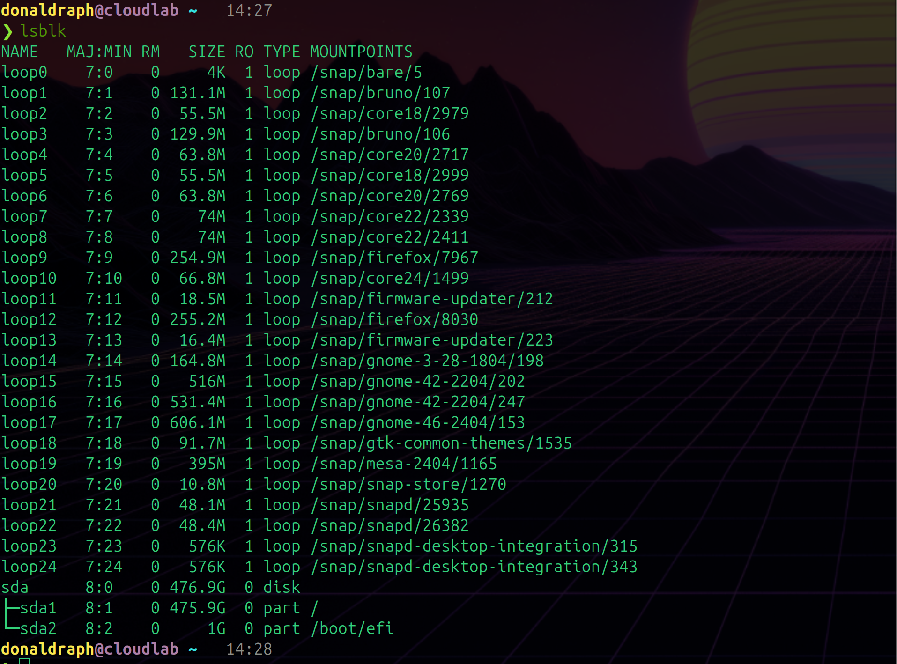
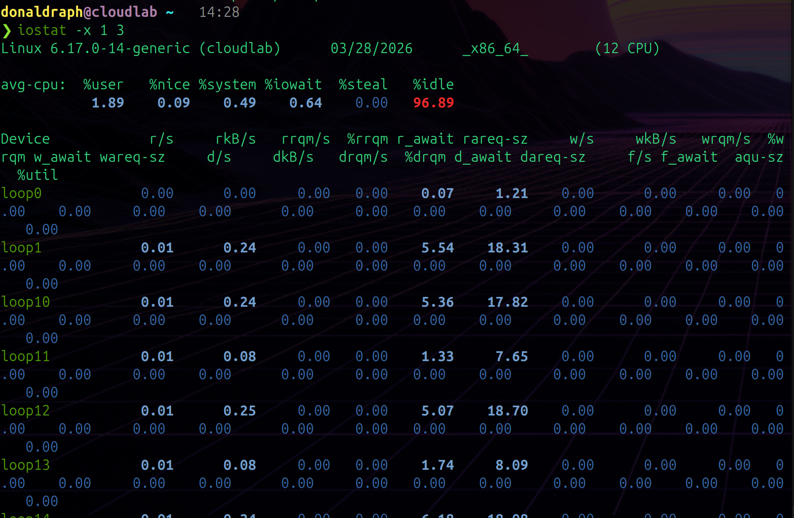
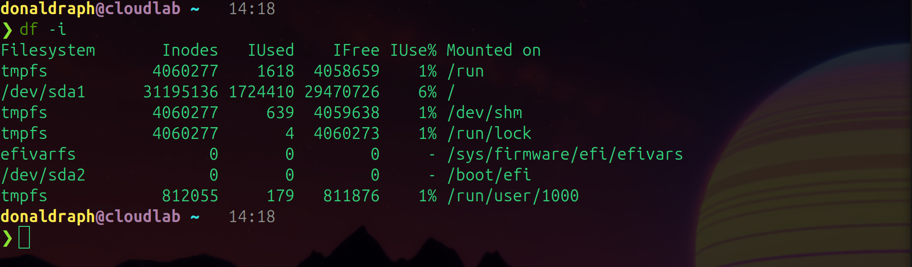

# Day 003 — Disk I/O and Filesystem

---

## 1. Disk Layout — `lsblk`

### Command
```bash
lsblk
```

### What It Shows
Lists all block devices — real disks, partitions, and loop devices — in a tree structure. Shows size, type, and where each one is mounted.

### Observations



What I noticed:
- One real disk — `sda` at 476.9GB
- `sda1` takes up almost all of it (475.9GB) and is mounted in multiple places — `/workspace`, `/etc/hosts`, `/etc/hostname`, `/root/.ssh`, `/root/.gitconfig`. All of these are Docker bind mounts pointing to the same underlying partition
- `sda2` is only 1GB — probably swap or boot
- A ton of `loop` devices — these are snap packages. They show `RO=1` (read-only) and are just mounted at boot, never written to again. Not real disks, just Ubuntu's way of isolating snap apps
- No separate `/` partition visible — because inside Docker the container root is an overlay filesystem, not a real block device

---

## 2. Disk Space — `df -hT`

### Command
```bash
df -hT
```

### What It Shows
Shows filesystem usage in human readable format. The `-T` adds the filesystem type column so you can see what kind each one is.

### Observations


Output observed:

```
Filesystem     Type     Size  Used Avail Use% Mounted on
overlay        overlay  468G  139G  306G  32% /
tmpfs          tmpfs     64M     0   64M   0% /dev
shm            tmpfs     64M     0   64M   0% /dev/shm
/dev/sda1      ext4     468G  139G  306G  32% /workspace
tmpfs          tmpfs    3.1G  2.6M  3.1G   1% /run/docker.sock
```

What I noticed:
- **overlay** filesystem at `/` — that's Docker's layered filesystem. Changes I make inside the container sit on top of the base image as a separate layer
- **ext4** on sda1 — this is the actual disk filesystem, same 468GB showing up as both the overlay root and `/workspace`
- 32% used, 306GB free — plenty of space
- **tmpfs** entries are RAM-backed — the `/dev/shm` and docker socket aren't using any real disk at all
- The disk and the container root show the same numbers because the overlay is built on top of sda1

---

## 3. Active Mounts — `mount | grep -E "^/dev"`

### Command
```bash
mount | grep -E "^/dev"
```

### What It Shows
Filters the mount table to only show real block device mounts. Each line shows the device, where it's mounted, the filesystem type, and mount options.

### Observations


Output observed:

```
/dev/sda1 on /workspace type ext4 (rw,relatime,stripe=8191)
/dev/sda1 on /root/.gitconfig type ext4 (ro,relatime,stripe=8191)
/dev/sda1 on /root/.ssh type ext4 (ro,relatime,stripe=8191)
/dev/sda1 on /etc/resolv.conf type ext4 (rw,relatime,stripe=8191)
/dev/sda1 on /etc/hostname type ext4 (rw,relatime,stripe=8191)
/dev/sda1 on /etc/hosts type ext4 (rw,relatime,stripe=8191)
```

What I noticed:
- Everything points to `sda1` — one real partition serving all these mount points
- `rw` vs `ro` — `.gitconfig` and `.ssh` are read-only mounts. Docker is sharing them from the host but protecting them from being modified inside the container
- `relatime` — only updates file access timestamps when the file is modified, not every single read. A small performance optimization
- `stripe=8191` — filesystem hint about storage stripe size, relevant for SSDs

---

## 4. Raw Disk Stats — `cat /proc/diskstats`

### Command
```bash
cat /proc/diskstats
```

### What It Shows
The raw kernel accounting file for every block device. Cumulative counters since boot — reads completed, sectors read, time spent, writes completed, sectors written. This is what `iostat` reads behind the scenes.

### Observations


What I noticed:
- The numbers are all cumulative since boot — they just keep going up, never reset
- `sda` line had the biggest numbers by far — all the real I/O went through it
- Loop devices had tiny numbers — mostly just read once at boot when the snap packages were mounted
- There are 17 fields per line and no labels — position determines meaning. Tools like `iostat` parse this and calculate rates by reading it twice and dividing by elapsed time. That's literally all `iostat` is doing

---

## 5. I/O Statistics — `iostat -x 1 5`

### Command
```bash
iostat -x 1 5
```

### What It Shows
Extended I/O stats refreshing every second, 5 times. First snapshot is cumulative since boot — always ignore it. The real readings start from snapshot 2.

### Observations



Key columns explained:
- **r/s** — reads per second hitting this device
- **w/s** — writes per second
- **r_await** — average milliseconds a read request waits (queue time + actual disk time)
- **w_await** — same for writes
- **%util** — percentage of time the disk was busy. 100% = saturated

What I saw on `sda` across live snapshots:
- Most snapshots: tiny or zero activity — disk almost completely idle
- One snapshot had `w/s: 47-58` with `w_await: 2-3ms` — a small write burst, very fast
- `%util` never exceeded 4% — the disk was barely being used at all
- All loop devices showed 0 during live snapshots — confirmed they're dormant after boot
- CPU `%iowait` stayed under 1% — CPU never waiting on disk

---

## 6. Inode Usage — `df -i`

### Command
```bash
df -i
```

### What It Shows
Same as `df` but shows inode counts instead of byte counts. Every file and directory on Linux needs one inode — a metadata record tracking its existence, permissions, size, timestamps. You can run out of inodes while still having disk space, which causes cryptic "no space left on device" errors.

### Observations



What I noticed:
- Inode usage was very low percentage-wise even though I had thousands of files
- tmpfs filesystems show inode counts too — interesting, even RAM-backed filesystems have inode limits
- The scenario where this matters: if you have a service writing millions of tiny log files or temp files, you can exhaust inodes long before you run out of space. `df -h` would show space available but `df -i` would show 100% inode usage

---

## 7. Lab — Generating Disk I/O with `dd`

### Command
```bash
mkdir -p /tmp/disk-test
dd if=/dev/zero of=/tmp/disk-test/bigfile bs=1M count=500 oflag=direct &
DD_PID=$!
```

### What It Shows
`dd` copies data from one place to another in fixed-size blocks. Using it to write 500MB of zeros to disk is the standard way to generate measurable I/O load for testing. `oflag=direct` bypasses the page cache so the writes actually hit the disk instead of just sitting in RAM.

### Observations
Result:
```
500+0 records in
500+0 records out
524288000 bytes (524 MB, 500 MiB) copied, 12.1989 s, 43.0 MB/s
```

What I noticed:
- **43 MB/s write speed** — decent. A fast SSD would show 500MB/s+, a spinning HDD maybe 100-150MB/s. This is somewhere in between
- The `oflag=direct` made a big difference — without it the kernel would've buffered everything in RAM and the write would've "finished" instantly without any actual disk I/O
- Ran in the background with `&` so I could observe it with iostat simultaneously

---

## 8. Lab — Stressing Inodes with 10,000 Files

### Command
```bash
for i in $(seq 1 10000); do touch /tmp/disk-test/file_$i; done
ls /tmp/disk-test | wc -l
```

### Observations
```
10001
```

Created 10,000 empty files plus the 500MB bigfile = 10,001 total. Each empty file uses an inode but zero bytes of actual disk space. This is how you exhaust inodes without filling the disk.

---

## 9. Lab — Measuring Find Performance

### Commands
```bash
time find /tmp/disk-test -name "file_999*"
time find /tmp/disk-test -type f | wc -l
```

### Observations
```
# Pattern search — found 11 matching files
find /tmp/disk-test -name "file_999*"  0.01s user 0.01s system 64% cpu 0.021 total

# Count all files
find /tmp/disk-test -type f  0.00s user 0.00s system 95% cpu 0.006 total
```

What I noticed:
- **0.021 seconds** to find matching files across 10,001 entries — very fast because everything was in the page cache (recently created)
- On a cold filesystem (after reboot) this would be slower because the kernel would need to read directory entries from disk
- The `time` command output has three values: `user` (time in your code), `system` (time in kernel), and `total` (wall clock). For disk-heavy operations the gap between system and total reveals how much time was spent waiting on I/O

---

## 10. Cleanup

```bash
rm -rf /tmp/disk-test
```

Deleted the bigfile and all 10,000 small files in one command. Disk space and inodes both returned to baseline immediately.

---

## What I Learned Today

- `/proc/diskstats` is where all disk monitoring tools get their data — it's just raw counters the kernel maintains
- `iostat` is just reading diskstats twice and doing maths — nothing magic about it
- `%util` and `r_await`/`w_await` together tell you if a disk is struggling. High util + high await = problem
- Inodes are a completely separate resource from disk space — you can run out of one while having plenty of the other
- `dd` with `oflag=direct` is the standard way to test real disk throughput
- The first snapshot in `iostat` is always cumulative since boot — ignore it, the real readings start from snapshot 2
- Loop devices are snap packages — they show up in every disk command but basically don't do anything after boot
