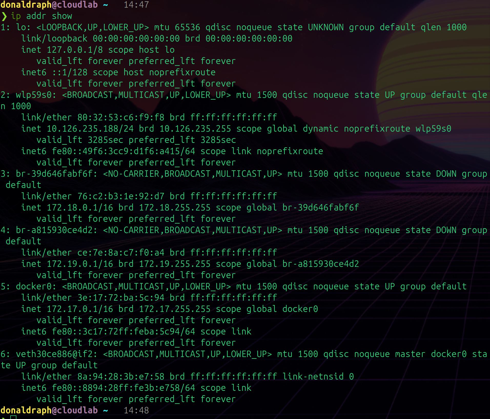
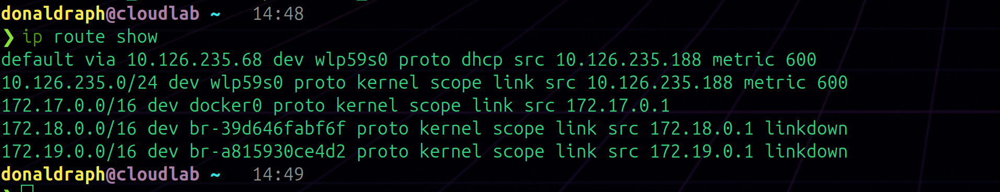
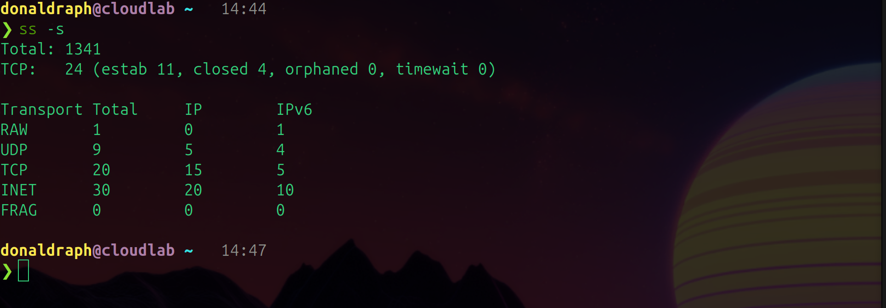
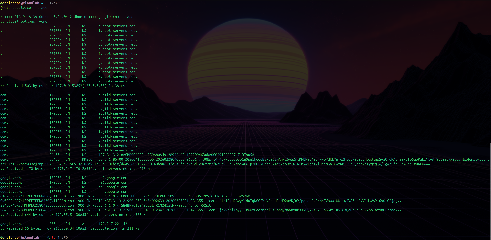
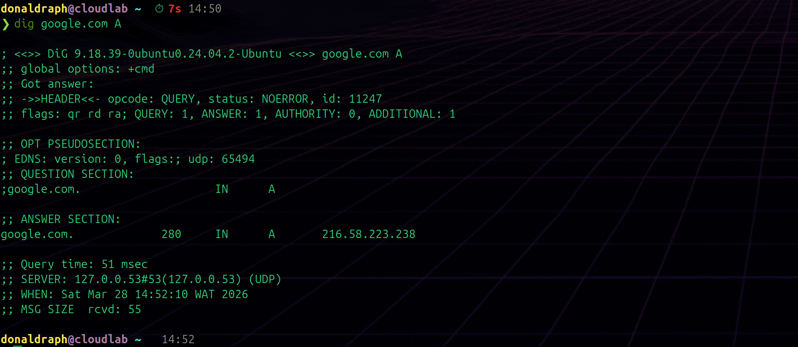

# Day 004 — Network Fundamentals: Packets and Connections

---

## 1. Network Interfaces — `ip addr show`

### Command
```bash
ip addr show
```

### What It Shows
Lists every network interface on the system — physical, virtual, loopback — with their IP addresses, MAC addresses, and state.

### Observations



Output observed:
```
1: lo: <LOOPBACK,UP,LOWER_UP> mtu 65536
    inet 127.0.0.1/8 scope host lo

2: wlp59s0: <BROADCAST,MULTICAST,UP,LOWER_UP> mtu 1500
    inet 10.210.179.188/24 brd 10.210.179.255 scope global dynamic

3: docker0: <BROADCAST,MULTICAST,UP,LOWER_UP> mtu 1500
    inet 172.17.0.1/16 scope global docker0

4: br-39d646fabf6f: <NO-CARRIER,...> state DOWN
    inet 172.18.0.1/16

5: br-a815930ce4d2: <NO-CARRIER,...> state DOWN
    inet 172.19.0.1/16

6: veth8d27eb5@if2: <BROADCAST,MULTICAST,UP,LOWER_UP>
    (no IPv4, only IPv6 link-local)
```

What I noticed:
- **lo** — loopback interface, always `127.0.0.1`. Traffic sent here goes straight back to the same machine. Used for local services talking to each other
- **wlp59s0** — my WiFi interface. `wlp` means wireless LAN, `59s0` is the slot. IP is `10.210.179.188` assigned by DHCP (`dynamic`). `/24` means the subnet is `10.210.179.0-255`
- **docker0** — Docker's bridge network, `172.17.0.1/16`. This is the gateway Docker containers connect to by default. I'm the gateway from their perspective
- **br-39d646fabf6f and br-a815930ce4d2** — extra Docker bridge networks, both `state DOWN` and `NO-CARRIER` — they exist but nothing is connected to them right now. Probably from old docker-compose networks
- **veth8d27eb5** — a virtual ethernet pair connecting my running container to `docker0`. One end is here, the other (`@if2`) is inside the container
- MTU 1500 on most interfaces — maximum transmission unit, the largest packet size. 65536 on loopback because there's no physical limit when talking to yourself

---

## 2. Routing Table — `ip route show`

### Command
```bash
ip route show
```

### What It Shows
How the kernel decides where to send packets. Each line is a rule: "if the destination matches this, send it via that."

### Observations



Output observed:
```
default via 10.210.179.44 dev wlp59s0 proto dhcp src 10.210.179.188 metric 600
10.210.179.0/24 dev wlp59s0 proto kernel scope link src 10.210.179.188 metric 600
172.17.0.0/16 dev docker0 proto kernel scope link src 172.17.0.1
172.18.0.0/16 dev br-39d646fabf6f proto kernel scope link src 172.18.0.1 linkdown
172.19.0.0/16 dev br-a815930ce4d2 proto kernel scope link src 172.19.0.1 linkdown
```

What I noticed:
- **default via 10.210.179.44** — this is my default gateway. Any packet going somewhere the kernel doesn't know directly gets sent to `10.210.179.44` (my router). `metric 600` is the priority — lower number wins if multiple routes exist
- **10.210.179.0/24 dev wlp59s0** — anything going to a `10.210.179.x` address goes directly out the WiFi interface, no gateway needed. These are local machines on the same network
- **172.17.0.0/16 dev docker0** — Docker container traffic routes through the docker0 bridge
- The `linkdown` routes exist but are marked down — those Docker networks have no active connections

---

## 3. DNS Configuration — `cat /etc/resolv.conf`

### Command
```bash
cat /etc/resolv.conf
```

### What It Shows
Where the system sends DNS queries. Every time you use a hostname like `google.com`, the system looks here to find out which DNS server to ask.

### Observations


Output observed:
```
nameserver 127.0.0.53
options edns0 trust-ad
search .
```

What I noticed:
- **nameserver 127.0.0.53** — DNS queries go to a local stub resolver running on this machine. `127.0.0.53` is `systemd-resolved` — it acts as a local DNS cache and forwards queries to real upstream servers
- This isn't the real DNS server — it's a middleman that caches results and handles DNSSEC
- Run `resolvectl status` to see the actual upstream DNS servers being used
- This file is managed by systemd and warns you not to edit it directly

---

## 4. All Listening Sockets — `ss -tunapl`

### Command
```bash
ss -tunapl
```

### What It Shows
Every network socket — TCP and UDP, listening and established. `-t` TCP, `-u` UDP, `-n` numeric (don't resolve names), `-a` all states, `-p` show process, `-l` listening.

### Observations


Key things I saw:
- **127.0.0.53:53** (TCP and UDP) — systemd-resolved listening for DNS queries locally
- **127.0.0.1:631** — CUPS (print service) listening on localhost
- **127.0.0.1:59691 and 35299** — VS Code server ports, used by the editor for remote features
- **\*:1716 and \*:1717** — KDE Connect listening on all interfaces — used for phone/desktop integration
- Everything on `127.0.0.1` only — these services are local only, not exposed to the network
- No externally exposed services — nothing listening on `0.0.0.0` except KDE Connect

---

## 5. TCP State Summary — `ss -s`

### Command
```bash
ss -s
```

### What It Shows
A quick count of sockets in each TCP state — how many are listening, established, time-wait, closed, etc.

### Observations



Output observed:
```
Total: 1341
TCP:   24 (estab 11, closed 4, orphaned 0, timewait 0)

Transport Total  IP    IPv6
RAW       1      0     1
UDP       9      5     4
TCP       20     15    5
INET      30     20    10
FRAG      0      0     0
```

What I noticed:
- **11 established connections** — browser, VS Code, system services all active
- **timewait: 0** — no connections sitting in cleanup state, system isn't under connection pressure
- **Total: 1341** — includes all socket types, most are internal kernel sockets not actual network connections
- This is the quick sanity check — if you ever see thousands of TIME_WAIT or CLOSE_WAIT, something is wrong with connection handling

---

## 6. DNS Trace — `dig google.com +trace`

### Command
```bash
dig google.com +trace
```

### What It Shows
The full DNS resolution path from root servers down to the final answer. Shows every hop in the DNS hierarchy.

### Observations



The path a DNS query takes:

1. **Local resolver** (`127.0.0.53`) — first stop. Checks its cache. If not cached, asks a root server
2. **Root servers** (a-m.root-servers.net) — the top of the DNS tree. They don't know google.com's IP but they know who manages `.com`
3. **TLD servers** (gtld-servers.net) — manage `.com`. They don't know google.com's IP but know Google's nameservers
4. **Google's nameservers** (ns1-4.google.com) — these know the actual IP. Returned `142.251.216.110`

The whole thing took about 600ms total across 3 hops. Once cached locally, future lookups are near-instant.

Interesting thing I noticed — there were IPv6 failures (`network unreachable`) when trying to reach some TLD servers. My network doesn't have IPv6 routing so it fell back to IPv4 automatically.

---

## 7. DNS Record Types

### Commands
```bash
dig google.com A       # IPv4 address
dig google.com AAAA    # IPv6 address
dig google.com MX      # Mail server
```

### Observations



**A record** (IPv4):
```
google.com.  10  IN  A  216.58.223.238
```
Query time: 38ms — not cached, had to go out

**AAAA record** (IPv6):
```
google.com.  95  IN  AAAA  2c0f:fb50:4003:802::200e
```
Query time: 0ms — already cached from the A record lookup

**MX record** (mail):
```
google.com.  295  IN  MX  10 smtp.google.com.
```
Priority `10` — lower number = higher priority. If there were multiple MX records, mail servers try the lowest number first.

---

## 8. TCP Connection Lab — `nc` and `ss`

### Commands
```bash
# Terminal 1 — listener
nc -l -p 9999

# Terminal 2 — watch states
watch -n 0.5 "ss -tnap | grep 9999"

# Terminal 3 — connect
nc localhost 9999
```

### What TCP States Look Like

**LISTEN** — server is waiting, no client yet:
```
tcp  LISTEN  0  1  0.0.0.0:9999  0.0.0.0:*
```

**ESTABLISHED** — client connected, both sides can exchange data:
```
tcp  ESTAB  0  0  127.0.0.1:9999   127.0.0.1:54321
tcp  ESTAB  0  0  127.0.0.1:54321  127.0.0.1:9999
```
Two rows — one for each side of the connection. Both show ESTABLISHED.

**TIME_WAIT** — client disconnected, server waiting for any stray packets:
```
tcp  TIME-WAIT  0  0  127.0.0.1:9999  127.0.0.1:54321
```
Stays here for ~60 seconds before disappearing completely.

What I noticed:
- Typing in one terminal and seeing it appear in the other makes TCP feel real — it's literally just a byte stream between two endpoints
- The TIME_WAIT state is the server being cautious — it's not broken, it's just making sure no late packets from the old connection show up and get confused with a new one
- Both sides of the connection show up in `ss` — you see the connection from both perspectives

---

## 9. HTTP Headers — `curl -v` and `tcpdump`

### Commands
```bash
# Start HTTP server
python3 -c "
from http.server import HTTPServer, BaseHTTPRequestHandler
class H(BaseHTTPRequestHandler):
    def do_GET(self):
        self.send_response(200)
        self.send_header('X-Custom', 'training')
        self.end_headers()
        self.wfile.write(b'hello')
HTTPServer(('', 8888), H).serve_forever()
" &

# See raw HTTP exchange
curl -v http://localhost:8888/

# See actual packets
sudo tcpdump -i lo port 8888 -A -c 20 &
curl -s http://localhost:8888/
```

### Observations


`curl -v` shows the full HTTP conversation:

**Request (client → server):**
```
> GET / HTTP/1.1
> Host: localhost:8888
> User-Agent: curl/7.81.0
> Accept: */*
```

**Response (server → client):**
```
< HTTP/1.1 200 OK
< Server: BaseHTTP/0.6 Python/3.10
< X-Custom: training
< 
hello
```

What I noticed:
- `>` lines are what curl sent, `<` lines are what the server returned
- The custom header `X-Custom: training` shows up exactly as set in the Python code — headers are just key-value pairs
- `tcpdump` shows the same conversation but as raw packet data — you can see the HTTP text inside the TCP payload
- HTTP/1.1 is plain text — you can read every header and the body directly in tcpdump output. HTTPS would be encrypted and unreadable

---

## What I Learned Today

- Every network interface has a purpose — loopback for local, physical for external, virtual for containers
- The routing table is just a lookup table: destination range → send via this interface/gateway
- DNS is a tree — root → TLD → domain nameserver → answer. Each level delegates to the next
- `systemd-resolved` at `127.0.0.53` is a local caching proxy, not the real DNS server
- TCP states are observable in real time with `ss` — LISTEN → ESTABLISHED → TIME_WAIT is the lifecycle
- TIME_WAIT is normal and expected — it's the kernel being careful, not a problem
- HTTP is plain text — curl -v and tcpdump show you exactly what's being sent and received
- `dig +trace` is the best tool for debugging DNS — shows every hop in the resolution chain
