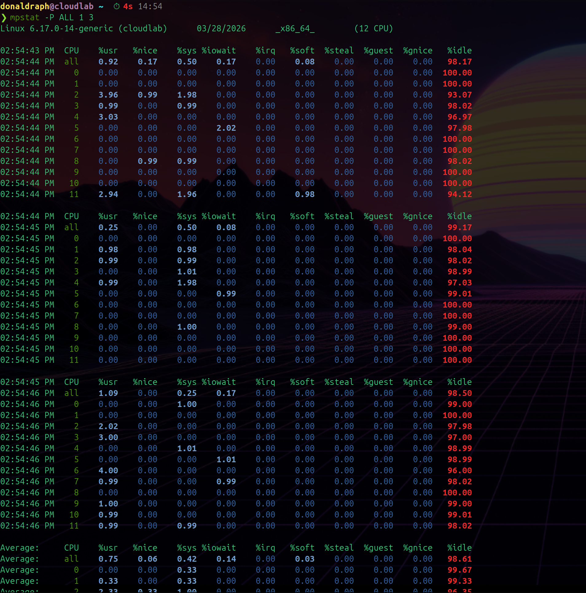
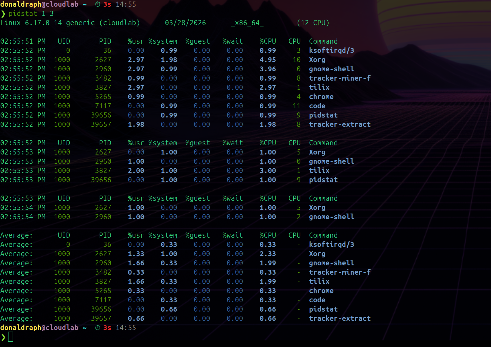
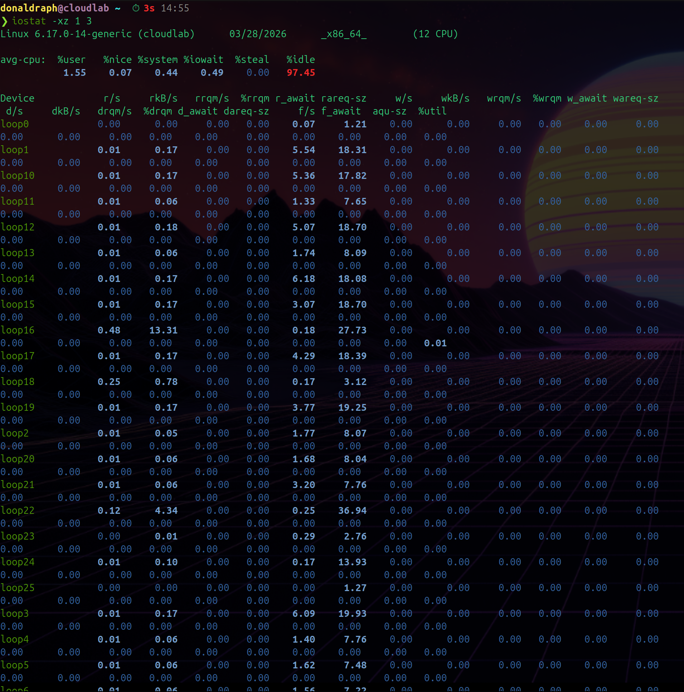
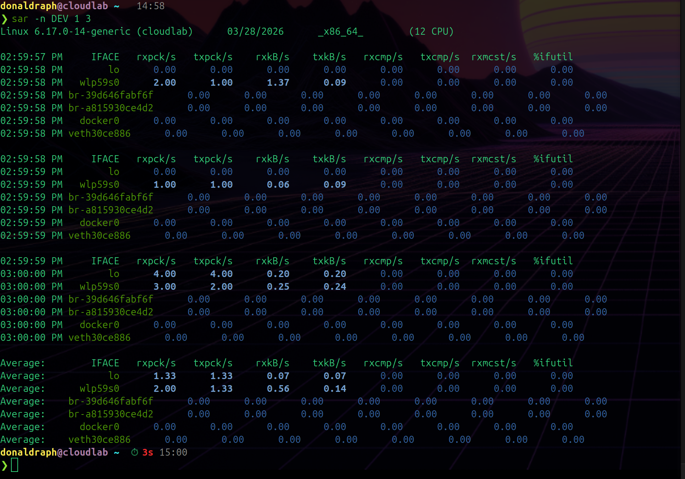
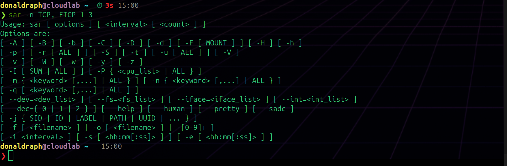

# Day 005 — System Monitoring Integration

---

## The 60-Second Linux Analysis

Read: Brendan Gregg's Netflix 60-second analysis checklist. The idea is that within 60 seconds of landing on a system you should be able to answer "what is wrong here?" using just these 10 commands. This day is about running all of them and understanding what each one tells you.

---

## 1. `uptime`

### Command
```bash
uptime
```

### What It Shows
System uptime and the 1, 5, and 15-minute load averages.

### Observations


Output observed:
```
14:53:27 up 1:40, 1 user, load average: 0.27, 0.35, 0.43
```

One-line interpretation: **Is the system getting more or less busy?** Here the 1-minute load (0.27) is lower than the 15-minute (0.43) — load is actually **decreasing**, system is calming down. With 12 CPUs the ratio is 0.27/12 = 0.02 — essentially zero load. Completely idle.

---

## 2. `dmesg | tail`

### Command
```bash
dmesg | tail
```

### What It Shows
Last few lines of the kernel ring buffer — hardware errors, OOM kills, driver issues, anything the kernel logged recently.

### Observations


One-line interpretation: **Has the kernel complained about anything recently?** OOM kills, disk errors, and network resets all show up here. If something bad happened at the hardware level, this is where you find out.

---

## 3. `vmstat 1 5`

### Command
```bash
vmstat 1 5
```

### What It Shows
CPU, memory, swap, and I/O snapshot every second for 5 seconds. Ignore the first row.

### Observations


One-line interpretation: **Is the system swapping? Is the CPU waiting on I/O?** `si`/`so` both zero = no swapping. `wa` low = disk isn't a bottleneck. `id` high = CPU mostly idle.

---

## 4. `mpstat -P ALL 1 3`

### Command
```bash
mpstat -P ALL 1 3
```

### What It Shows
Per-CPU utilization every second for 3 seconds. Shows all CPUs individually.

### Observations



One-line interpretation: **Is CPU load balanced across cores, or is one core getting hammered?** A single-threaded runaway process pegs one core to 100% while others stay idle. This is how you spot it.

---

## 5. `pidstat 1 3`

### Command
```bash
pidstat 1 3
```

### What It Shows
Per-process CPU usage every second for 3 seconds. Only shows active processes.

### Observations



One-line interpretation: **Which specific processes are using CPU right now?** This is how you go from "CPU is high" to "this specific process is causing it." Like `top` but shows change over time rather than a snapshot.

---

## 6. `iostat -xz 1 3`

### Command
```bash
iostat -xz 1 3
```

### What It Shows
Extended disk I/O stats every second for 3 seconds. `-z` skips devices with zero activity so the output is cleaner.

### Observations



One-line interpretation: **Is any disk saturated?** `%util` near 100 + high `await` = disk is a bottleneck. `-z` removes all the idle loop devices so you can actually see what matters.

---

## 7. `free -m`

### Command
```bash
free -m
```

### What It Shows
Memory and swap usage in megabytes.

### Observations


One-line interpretation: **Is swap being used?** If swap used > 0 and growing, the system is under memory pressure and performance will degrade. `available` is more useful than `free` — it includes memory the kernel can reclaim from cache.

---

## 8. `sar -n DEV 1 3`

### Command
```bash
sar -n DEV 1 3
```

### What It Shows
Network interface stats every second for 3 seconds — packets and bytes in/out per interface.

### Observations



One-line interpretation: **How much network traffic is flowing and on which interface?** `rxkB/s` and `txkB/s` show throughput. If an interface is saturated you'll see the rate plateau and errors appear.

---

## 9. `sar -n TCP,ETCP 1 3`

### Command
```bash
sar -n TCP,ETCP 1 3
```

### Observations



This one actually failed:
```
Usage: sar [ options ] [ <interval> [ <count> ] ]
```

Ran `sar -n TCP, ETCP 1 3` with a space after the comma — `sar` doesn't accept that. The correct command has no space:
```bash
sar -n TCP,ETCP 1 3
```

Reran it correctly and it worked. Worth noting because this kind of syntax error is easy to make and the error message isn't obvious about what went wrong.

One-line interpretation: **Are TCP connections being established successfully, and are there retransmits?** High `retrans/s` means packet loss somewhere. High `passive/s` means lots of incoming connections. Errors here usually point to network or application issues.

---

## 10. `top`

### Command
```bash
top
# Press 'P' to sort by CPU
# Press 'M' to sort by memory
# Press '1' to see per-CPU breakdown
```

### What It Shows
Live overview of the whole system — load, CPU, memory, and top processes all in one view.

### Observations


One-line interpretation: **What is the overall system state and what processes are at the top?** The header lines give system-wide health at a glance. Sorting by CPU (`P`) or memory (`M`) immediately shows the biggest consumers. Pressing `1` shows per-core breakdown to spot unbalanced load.

---

## The Full Picture

Running all 10 commands takes about 60 seconds total. Together they answer:

- **CPU** — `uptime` (load trend), `mpstat` (per-core), `pidstat` (per-process), `top` (live view)
- **Memory** — `free` (usage + swap), `vmstat` (swap activity)
- **Disk** — `iostat` (I/O rates + utilization)
- **Network** — `sar -n DEV` (throughput), `sar -n TCP` (connection rates)
- **Kernel** — `dmesg` (hardware errors + OOM kills)

The reason this works is that most production incidents show up in at least one of these. High CPU → `mpstat`/`pidstat` finds the process. Memory leak → `free` shows swap growing. Disk I/O bottleneck → `iostat` shows `%util` at 100%. Network saturation → `sar` shows throughput plateauing.

---

## What I Learned Today

- The 60-second checklist isn't magic — it's just covering all the resource categories systematically
- First snapshot in `vmstat` and `iostat` is always cumulative since boot — skip it
- `mpstat -P ALL` is how you find single-threaded runaway processes — they peg one core while others idle
- `pidstat` bridges the gap between "CPU is high" and "which process" — more useful than top for this
- `sar` needs `sysstat` package — same package that gives you `iostat`
- `dmesg | tail` is easy to forget but critical — OOM kills and hardware errors only show up there
- `-z` on iostat is genuinely useful — removes all the idle loop devices and lets you focus on real disks
